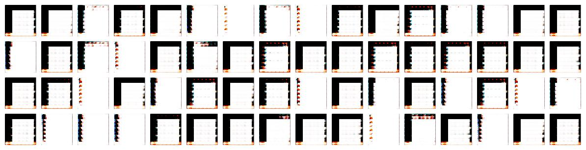

# Wasserstein GAN (with Gradient Penalty) 
[](https://www.tensorflow.org/)
[](https://github.com/asahi417/WassersteinGAN/blob/master/LICENSE)

Tensorflow implementation of [Wasserstein GAN](https://arxiv.org/pdf/1701.07875.pdf) with [gradient penalty](https://papers.nips.cc/paper/7159-improved-training-of-wasserstein-gans.pdf)
and [DCGAN](https://arxiv.org/pdf/1511.06434.pdf).
Properties are summalized as below

- Tested by [CelebA dataset](http://mmlab.ie.cuhk.edu.hk/projects/CelebA.html) 
- Data is encoded as TFRecord format


## How to use it ?
Clone the repository

```
git clone https://github.com/asahi417/WassersteinGAN
cd WassersteinGAN
pip install .
mkdir datasets
```

CelebA dataset need to be downloaded from [here](http://mmlab.ie.cuhk.edu.hk/projects/CelebA.html), and be located below the directory `datasets`, so the data directory should be seems like

```
WassersteinGAN/datasets/celeba/img/img_align_celeba
```

***TFRecord***

To produce TFRecord file, 

```
python bin/build_tfrecord.py --data celeba -r 64 -c 108

optional arguments:
    -c [CROP], --crop [CROP] Each image will be center cropped by this integer.
    -r [RESIZE], --resize [RESIZE] Each image will be resized by this integer.
``` 

***Train Model***

```
python bin/train.py -m [MODEL] -e [EPOCH] -c [CROP] -r [RESIZE] --data [DATA]

optional arguments:
  -m [MODEL], --model [MODEL] `dcgan` or `wgan`
  -e [EPOCH], --epoch [EPOCH] Epoch.
  -c [CROP], --crop [CROP]
  -r [RESIZE], --resize [RESIZE]
```

Hyperparameters are [here](./bin/hyperparameter).

***Visualization***

```
usage: generate_img.py -m [MODEL] -v [VERSION] -c [CROP] -r [RESIZE] --data [DATA]

optional arguments:
  -m [MODEL], --model [MODEL] `dcgan` or `wgan`
  -v [VERSION], --version [VERSION] version of checkpoint
  -c [CROP], --crop [CROP]
  -r [RESIZE], --resize [RESIZE]
```

## Generated Images
Images are arbitrary generated by random variables sampled from normal distribution.

***WGAN-GP (Gradient Penalty)***

<p align="center">
  
  <br><i>Fig 1: WGAN-GP with epoch 110</i>
</p>

***WGAN***

<p align="center">
  
  <br><i>Fig 2: WGAN with epoch 30</i>
</p>

***DCGAN***

<p align="center">
  
  <br><i>Fig 3: DCGAN with epoch 30</i>
</p>


## Discussions

To evaluate stability of training, following metrics are considered:
- 1. mode collapse
- 2. local minima
- 3. overfitting
- 4. quality of generated images

***1. mode collapse***

DCGAN easily suffers from mode collapse like, usually you find tendency of mode collapse after 30 ~ 40 epoch.

<p align="center">
  
  <br><i>Fig 4: Example of mode collapse (DCGAN with epoch 30) </i>
</p>


I actually wan't able to train model, which can produce variety of images in my experiments. 
WGAN with and without GP are really good at avoiding mode collapse even after running large epoch.

***2. trapped by local minima***

DCGAN are often trapped by undesired local minima as well as mode collapse.
Here are some examples from DCGAN trapped by local minima. Once a model get trapped, it would be never improved anymore. 

<p align="center">
  
  
  
  <br><i>Fig 5: Examples of local minima (three separatelly trained DCGAN ending up training with local minima) </i>
</p>

WGAN with and without GP seems have capacity to escape from those local minima so that I don't have any cases that WGAN trapped by local minima.  
 
***3. overfitting (too strong critic?)***

Vanilla WGAN (without GP) is likely to be overfitted after 40 epoch.
Even though a model seems properly trained (such as the model produces Fig 2 at epoch 30),
it suddenly start to generate crappy images and finish training with something like Fig 6.

<p align="center">
  
  <br><i>Fig 6: Examples of overfitting (WGAN with epoch 50) </i>
</p>

It's kinda similar to local minima but unlike trapped by local minima immediately, this phenomena usually allow generator to be trained properly once, then the generator would be messed up after a while.

On the other hand, WGAN-GP have never caused this. From Fig 7, you can see that WGAN-GP actually can generates images with competitive quality even by 60 epoch.
I have kept training this model for more 60 epoch and attained Fig 1, so WGAN-GP rarely has overfitting problem.  

<p align="center">
  
  <br><i>Fig 7: WGAN-GP with epoch 60 </i>
</p>

In the end, I'm not sure if this can be referred as overfitting so let me know if you have proper name for this type of problem.

***4. quality***

I have't tried any metrics to evaluate quality of generated image such as inception score.
By seeing the images, generated from each models (Fig 1 ~3), WGAN-GP is seems producing the best quality-images. 

***conclusion***

Let's say training model with same hyperaprameters five times:

- DCGAN: three out of five models would fail (one would end up with mode collapse and two would be trapped by local minima).
- WGAN: two out of five models would fail (two for overfitting)
- WGAN-GP: Never fail!
    
WGAN with GP is the most stable model, which also have capacity to produce diversity image with relatively high quality with comparing vanilla WGAN and DCGAN.
 

## Tips
Here, I listed a few tips, used in this implementations. 
While it's hard to train without those tips for DCGAN and vanilla WGAN,
WGAN-GP does't need any specific tips (it's quite friendly, isn't it?)   

- [Advantage for generator in DCGAN](https://github.com/asahi417/WassersteinGAN/blob/master/wgan/dcgan.py#L249)
- [Enhance critics training in vanilla WGAN](https://github.com/asahi417/WassersteinGAN/blob/master/wgan/wgan.py#L255)

## Hyperparameters
- WGAN-GP
```
{
  "gradient_penalty": 10,
  "batch": 128,
  "optimizer": "adam",
  "learning_rate": 1e-05,
  "n_critic": 5,
  "initializer": "truncated_normal",
  "config": {
    "n_z": 100,
    "image_shape": [
      64,
      64,
      3
    ]
  },
  "config_critic": {
    "mode": "cnn",
    "parameter": {
      "batch_norm": false
    }
  },
  "config_generator": {
    "mode": "cnn",
    "parameter": {
      "batch_norm": true,
      "batch_norm_decay": 0.99,
      "batch_norm_scale": true
    }
  }
}
```
- WGAN
```
{
  "gradient_clip": 0.05,
  "batch": 64,
  "optimizer": "rmsprop",
  "learning_rate": 5e-05,
  "n_critic": 5,
  "initializer": "truncated_normal",
  "overdose": true,
  "config": {
    "n_z": 100,
    "image_shape": [
      64,
      64,
      3
    ]
  },
  "config_critic": {
    "mode": "cnn",
    "parameter": {
      "batch_norm": true,
      "batch_norm_decay": 0.99,
      "batch_norm_scale": true
    }
  },
  "config_generator": {
    "mode": "cnn",
    "parameter": {
      "batch_norm": true,
      "batch_norm_decay": 0.99,
      "batch_norm_scale": true
    }
  }
}
```
- DCGAN
```
{
  "batch": 64,
  "optimizer": "adam",
  "learning_rate": 2e-05,
  "generator_advantage": 2,
  "initializer": "truncated_normal",
  "config": {
    "n_z": 100,
    "image_shape": [
      64,
      64,
      3
    ]
  },
  "config_critic": {
    "mode": "cnn",
    "parameter": {
      "batch_norm": true,
      "batch_norm_decay": 0.99,
      "batch_norm_scale": true
    }
  },
  "config_generator": {
    "mode": "cnn",
    "parameter": {
      "batch_norm": true,
      "batch_norm_decay": 0.99,
      "batch_norm_scale": true
    }
  }
}
```