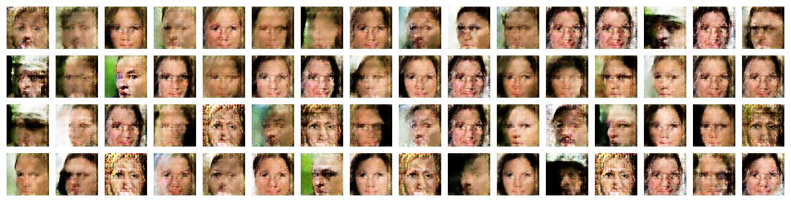
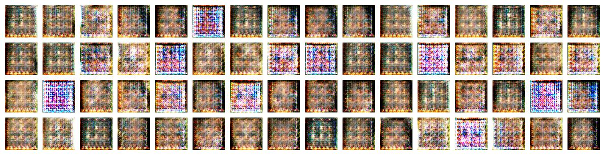

# Wasserstein GAN (with Gradient Penalty) 
[](https://www.tensorflow.org/)
[](https://github.com/asahi417/WassersteinGAN/blob/master/LICENSE)

Tensorflow implementation of [Wasserstein GAN](https://arxiv.org/pdf/1701.07875.pdf) with [gradient penalty](https://papers.nips.cc/paper/7159-improved-training-of-wasserstein-gans.pdf)
and [DCGAN](https://arxiv.org/pdf/1511.06434.pdf).
Properties are summalized as below

- Tested by [CelebA dataset](http://mmlab.ie.cuhk.edu.hk/projects/CelebA.html) 
- Data is encoded as TFRecord format


## How to use it ?
Clone the repository

```
git clone https://github.com/asahi417/WassersteinGAN
cd WassersteinGAN
pip install .
mkdir datasets
```

CelebA dataset need to be downloaded from [here](http://mmlab.ie.cuhk.edu.hk/projects/CelebA.html), and be located below the directory `datasets`, so the data directory should be seems like

```
WassersteinGAN/datasets/celeba/img/img_align_celeba
```

***TFRecord***

To produce TFRecord file, 

```
python bin/build_tfrecord.py --data celeba -r 64 -c 108

optional arguments:
    -c [CROP], --crop [CROP] Each image will be center cropped by this integer.
    -r [RESIZE], --resize [RESIZE] Each image will be resized by this integer.
``` 

***Train Model***

```
python bin/train.py -m [MODEL] -e [EPOCH] -c [CROP] -r [RESIZE] --data [DATA]

optional arguments:
  -m [MODEL], --model [MODEL] `dcgan` or `wgan`
  -e [EPOCH], --epoch [EPOCH] Epoch.
  -c [CROP], --crop [CROP]
  -r [RESIZE], --resize [RESIZE]
```

Hyperparameters are [here](./bin/hyperparameter).

***Visualization***

```
usage: generate_img.py -m [MODEL] -v [VERSION] -c [CROP] -r [RESIZE] --data [DATA]

optional arguments:
  -m [MODEL], --model [MODEL] `dcgan` or `wgan`
  -v [VERSION], --version [VERSION] version of checkpoint
  -c [CROP], --crop [CROP]
  -r [RESIZE], --resize [RESIZE]
```

## Generated Images
Images are arbitrary generated by random variables sampled from normal distribution.

***WGAN-GP (Gradient Penalty) with epoch 110***

<p align="center">
  
  <br><i>Fig 1: WGAN-GP (Gradient Penalty) with epoch 110</i>
</p>

***WGAN with epoch 30***

<p align="center">
  
  <br><i>Fig 2: WGAN with epoch 30</i>
</p>

***DCGAN with epoch 30***

<p align="center">
  
  <br><i>Fig 3: DCGAN with epoch 30</i>
</p>


## Discussions

### Which model is easy or hard to train?
To evaluate stability of training, following metrics are considered:
- mode collapse
- local minima
- overfitting
- quality of generated images

***mode collapse***

DCGAN easily suffers from mode collapse like, usually you find tendency of mode collapse after 30 ~ 40 epoch.

<p align="center">
  
  <br><i>Fig 4: Example of mode collapse (DCGAN with epoch 30) </i>
</p>


I actually wan't able to train model, which can produce variety of images in my experiments. 
WGAN with and without GP are really good at avoiding mode collapse even after running large epoch.

***local minima***

DCGAN are often trapped by undesired local minima as well as mode collapse.
Here are some examples from DCGAN trapped by local minima. Once a model get trapped, it would be never improved anymore. 

<p align="center">
  
  
  <br><i>Fig 5: Example of local minima (DCGAN with epoch 30) </i>
</p>

WGAN with and without GP seems have capacity to escape from those local minima so that I don't have any cases that WGAN trapped by local minima.  
 
***overfitting***

Vanilla WGAN (without GP) is likely to be overfitted after 40 epoch. For instance,  

***conclusion***

Let's say training model with same hyperaprameters five times:

- DCGAN: three out of five models would fail (one would end up with mode collapse and two would be trapped by local minima).
- WGAN: two out of five models would fail (two for overfitting)
- WGAN with GP: Never fail!
    
WGAN with GP is the most stable model, which also have capacity to produce diversity image with relatively high quality with comparing vanilla WGAN and DCGAN.

### Quality of 

### Tips
Here, I listed a few tips, used in this implementations. 
While it's hard to train without those tips for DCGAN and vanilla WGAN,
WGAN with GP does't need any specific tips (it's quite friendly, isn't it?)   

- Advantage for generator in DCGAN
- Enhance critics training in WGAN (with out GP)

